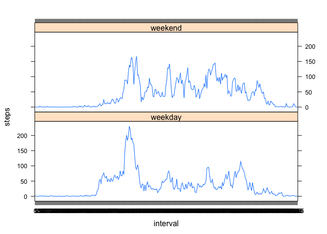

# Reproducible Research: Peer Assessment 1


## Loading and Preprocessing the data


```r
activity<-read.csv("activity.csv")
str(activity)
```

```
## 'data.frame':	17568 obs. of  3 variables:
##  $ steps   : int  NA NA NA NA NA NA NA NA NA NA ...
##  $ date    : Factor w/ 61 levels "2012-10-01","2012-10-02",..: 1 1 1 1 1 1 1 1 1 1 ...
##  $ interval: int  0 5 10 15 20 25 30 35 40 45 ...
```

```r
activity$interval<-as.factor(activity$interval)
activity$Date<-as.Date(activity$date)
str(activity)
```

```
## 'data.frame':	17568 obs. of  4 variables:
##  $ steps   : int  NA NA NA NA NA NA NA NA NA NA ...
##  $ date    : Factor w/ 61 levels "2012-10-01","2012-10-02",..: 1 1 1 1 1 1 1 1 1 1 ...
##  $ interval: Factor w/ 288 levels "0","5","10","15",..: 1 2 3 4 5 6 7 8 9 10 ...
##  $ Date    : Date, format: "2012-10-01" "2012-10-01" ...
```

## What is the mean total number of steps taken per day?
First make a dataset with the sum of steps per day (ignoring the missing values in the dataset).

```r
data.sum<-aggregate(activity$steps, by= list(activity$date), FUN="sum")
names(data.sum)<-c("date","steps")
head(data.sum)
```

```
##         date steps
## 1 2012-10-01    NA
## 2 2012-10-02   126
## 3 2012-10-03 11352
## 4 2012-10-04 12116
## 5 2012-10-05 13294
## 6 2012-10-06 15420
```

```r
str(data.sum)
```

```
## 'data.frame':	61 obs. of  2 variables:
##  $ date : Factor w/ 61 levels "2012-10-01","2012-10-02",..: 1 2 3 4 5 6 7 8 9 10 ...
##  $ steps: int  NA 126 11352 12116 13294 15420 11015 NA 12811 9900 ...
```

Plotting a histogram:

```r
hist(data.sum$steps, nclass=30, xlab="steps", main="Histogram of the total steps per day")
```

 

Find out the mean and the median of steps taken per day:

```r
mean(data.sum$steps, na.rm=TRUE)
```

```
## [1] 10766
```

```r
median(data.sum$steps, na.rm=TRUE)
```

```
## [1] 10765
```
1. The mean number of steps taken per day is 10766.19.
2. The median number of steps taken per day is 10765.


## What is the average daily activity pattern?
1. Time series plot of the 5-minute interval (x-axis) and the average number of steps taken, averaged across all days (y-axis)

It is necessary to make a dataset with the mean number of steps per time interval.

```r
data.mean<-aggregate(activity$steps ~activity$interval, FUN="mean")
names(data.mean)<-c("interval","steps")
str(data.mean)
```

```
## 'data.frame':	288 obs. of  2 variables:
##  $ interval: Factor w/ 288 levels "0","5","10","15",..: 1 2 3 4 5 6 7 8 9 10 ...
##  $ steps   : num  1.717 0.3396 0.1321 0.1509 0.0755 ...
```

Convert the variable interval to time of the day.

```r
data.mean$timeOfDay <- strptime(sprintf("%04d", as.numeric(as.character(data.mean$interval))), "%H%M")
```


Making a time series plot.


```r
plot(data.mean$timeOfDay, data.mean$steps, type = "l", xlab="interval", ylab="Mean number of steps", main= "Time series plot: Mean number of steps per interval")
```

 

2. Which 5-minute interval, on average across all the days in the dataset, contains the maximum number of steps?

Find out the maximum number of steps:

```r
max(data.mean$steps)
```

```
## [1] 206.2
```

Create a subset to figure out the interval belonging to the max value:

```r
data.max <- subset(data.mean[data.mean$steps>206,])
data.max
```

```
##     interval steps           timeOfDay
## 104      835 206.2 2014-07-19 08:35:00
```
Answer: The interval 835 contains the maximum number of steps.


#Imputing missing values

1. Calculate and report the total number of missing values in the dataset (i.e. the total number of rows with NAs)

```r
good <- complete.cases(activity)
nobs <- sum(good)
length(activity$steps)-nobs
```

```
## [1] 2304
```
Answer: There are 2304 rows with NAs in the activity dataset.

2. Devise a strategy for filling in all of the missing values in the dataset. The strategy does not need to be sophisticated. For example, you could use the mean/median for that day, or the mean for that 5-minute interval, etc.

Use the mean value of steps per interval to impute missing values. (There are missing values for some dates, therofore mean steps per interval is better).
The dataset with the corresponding mean number os steps per interval was created in the dataset data.mean.


* Create new variable to show missing value TRUE or FALSE.
* Create new variable with the mean number od steps per value.
* Replace value for steps, only when missing ==TRUE.


```r
activity$missing<-is.na(activity$steps)
meansteps <- data.mean$steps
activity$meansteps <- meansteps
activity$steps[activity$missing==TRUE] <- activity$meansteps
```

```
## Warning: Anzahl der zu ersetzenden Elemente ist kein Vielfaches der
## Ersetzungslänge
```
As we need counts of steps, use the round function to round up the mean values.

```r
activity$steps<-round(activity$steps)
```
3. Create a new dataset that is equal to the original dataset but with the missing data filled in.

Select only the columns that were present in the original dataset (date, interval and steps)

```r
activity.imp<-activity[,1:3]
```

4. Make a histogram of the total number of steps taken each day and Calculate and report the mean and median total number of steps taken per day. Do these values differ from the estimates from the first part of the assignment? What is the impact of imputing missing data on the estimates of the total daily number of steps?

Use the aggregate function to make a dataset with the sum of steps per interval.


```r
imp.sum<-aggregate(activity.imp$steps, by= list(activity$date), FUN="sum")
names(imp.sum)<-c("date","steps")
head(imp.sum)
```

```
##         date steps
## 1 2012-10-01 10762
## 2 2012-10-02   126
## 3 2012-10-03 11352
## 4 2012-10-04 12116
## 5 2012-10-05 13294
## 6 2012-10-06 15420
```

Plot a histogram:

```r
hist(imp.sum$steps, nclass=30, xlab="steps", main="Histogram of the total steps per day")
```

 
Calculate mean and median number of steps

```r
mean(imp.sum$steps, na.rm=TRUE)
```

```
## [1] 10766
```

```r
median(imp.sum$steps, na.rm=TRUE)
```

```
## [1] 10762
```
Answers:
* The mean number of steps taken per day is 10765.64.
* The median number of steps taken per day is 10762.
* The mean and median number of steps are slightly different, when using the imputed dataset.
* Imputing resulted in a slightly higher mean value and a slightly lower median number of steps.


#Are there differences in activity patterns between weekdays and weekends?


For this part the weekdays() function may be of some help here. Use the dataset with the filled-in missing values for this part.

1. Create a new factor variable in the dataset with two levels – “weekday” and “weekend” indicating whether a given date is a weekday or weekend day.


```r
activity.imp$date<-as.Date(activity$date)
activity.imp<-transform(activity.imp, weekend=as.POSIXlt(date, format='%Y/%m/%d')$wday %in% c(0, 6))
activity.imp$day <- "weekday"
activity.imp$day[activity.imp$weekend==TRUE] <- "weekend"
activity.imp$day<-as.factor(activity.imp$day)
```

2. Make a panel plot containing a time series plot (i.e. type = "l") of the 5-minute interval (x-axis) and the average number of steps taken, averaged across all weekday days or weekend days (y-axis).


```r
weekday.mean<-aggregate(activity.imp$steps, by=list(activity.imp$interval, activity.imp$day), FUN="mean")
names(weekday.mean)<-c("interval","day", "steps")
library(lattice)
xyplot(steps~interval|day, data=weekday.mean, type = "l", layout=c(1,2))
```

 

